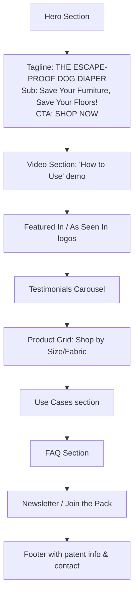

# 🐾 Pivot Guide: NestCraft Living (Furniture) → PeeKeeper-Inspired Dog Diaper E-Commerce

> **Last Updated:** July 11, 2026  
> **Source App:** NestCraft Living — Next.js 15 E-commerce CMS  
> **Target Business:** Premium escape-proof dog diapers (inspired by [PeeKeeper.com](https://peekeeper.com))
> **Reference Brand:** [PeeKeeper](https://peekeeper.com/) — America's Original Escape-Proof Diaper for Dogs & Cats

---

## 📋 Table of Contents

1. [Overview & Architecture](#1-overview--architecture)
2. [Phase 0: Clone & Setup](#2-phase-0-clone--setup)
3. [Phase 1: Brand Identity (Inspired by PeeKeeper)](#3-phase-1-brand-identity-inspired-by-peekeeper)
4. [Phase 2: Environment & Backend Config](#4-phase-2-environment--backend-config)
5. [Phase 3: Content Migration - JSON Files](#5-phase-3-content-migration---json-files)
6. [Phase 4: Product Data (PeeKeeper-Inspired)](#6-phase-4-product-data-peekeeper-inspired)
7. [Phase 5: Hardcoded Brand References](#7-phase-5-hardcoded-brand-references)
8. [Phase 6: Blueprint / Theme (PeeKeeper Aesthetic)](#8-phase-6-blueprint--theme-peekeeper-aesthetic)
9. [Phase 7: Backend / MongoDB](#9-phase-7-backend--mongodb)
10. [Phase 8: Images & Assets](#10-phase-8-images--assets)
11. [Phase 9: Navigation & Menus](#11-phase-9-navigation--menus)
12. [Phase 10: Verify & Deploy](#12-phase-10-verify--deploy)
13. [File Change Checklist](#13-file-change-checklist)
14. [New Category Structure](#14-new-category-structure)
15. [Sample Product Data (PeeKeeper-Style)](#15-sample-product-data-peekeeper-style)
16. [PeeKeeper Brand Reference Card](#16-peekeeper-brand-reference-card)
17. [Script: Global Find & Replace](#17-script-global-find--replace)

---

## 1. Overview & Architecture

### Current App (NestCraft Living)

```
Tech Stack: Next.js 15 (App Router) + Redux Toolkit + MongoDB + Tailwind CSS
Purpose: Premium furniture e-commerce CMS
```

### Target (PeeKeeper-Inspired Dog Diaper Store)

```
Tech Stack: Same — no backend changes needed
Purpose: D2C e-commerce for escape-proof dog diapers & pet care accessories
```

### Key Architecture Points

| Layer | Technology | What to Change |
|-------|-----------|----------------|
| **Frontend** | Next.js 15 App Router | Brand name, content text, images |
| **State** | Redux Toolkit | Hardcoded tenant headers |
| **Content** | JSON files in `data/` | All text, product data, categories |
| **Styling** | Tailwind CSS + Blueprint CSS vars | Theme colors → PeeKeeper palette |
| **Backend** | MongoDB (via REST API proxy) | Tenant registry, products collection |
| **API** | Next.js API routes + proxy | Tenant IDs |
| **Auth** | JWT + bcrypt | No change needed |
| **i18n** | `[locale]` prefix routing | Translate content |

---

## 2. Phase 0: Clone & Setup

```bash
# Clone the repo
git clone <your-repo-url> peekeeper-clone
cd peekeeper-clone

# Install dependencies
npm install

# Copy environment file
cp .env .env.local

# Start development server
npm run dev
# → Verify at http://localhost:3000
```

---

## 3. Phase 1: Brand Identity (Inspired by PeeKeeper)

### Step 1.1 — Brand DNA

PeeKeeper is a **family-operated American business** founded in **2009** by **Lisa**, who created the product out of personal necessity when her dog **Dash** suffered from urinary incontinence. The key differentiator is the **patented escape-proof harness design** that prevents dogs from wiggling out of their diaper.

**Core Value Proposition:**
> **"The ESCAPE-PROOF Dog Diaper — Save Your Furniture, Save Your Floors!"**

**Brand Voice:**
- Authentic, personal, empathetic, unpretentious
- Problem-solving & practical
- Community-focused ("Happy Pet is a Happy You!")
- Proudly family-owned, made in USA

### Step 1.2 — Choose Your Brand Name

Options inspired by PeeKeeper's utility-focused naming:
- **PeeKeeper** (direct) → `peekeeper.com` *(taken — but you can build a similar brand)*
- **PawsGuard** → `pawsguard.com`
- **DiaperLock** → `diaperlock.com`
- **CozyGuard** → `cozyguard.com`
- **SafePaws** → `safepaws.com`
- **EscapeProof** → `escapeproofpets.com`

> **💡 Pro tip:** A descriptive, benefit-driven name (like PeeKeeper) works well for this niche. Avoid cutesy names — PeeKeeper's success comes from sounding like a **solution**, not a toy.

### Step 1.3 — Define Brand Variables

| Variable | Example Value (PeeKeeper-style) |
|----------|--------------------------|
| `COMPANY_NAME` | PawsGuard |
| `PROJECT_SLUG` | pawsguard |
| `TENANT_ID` | kp_pawsguard |
| `TENANT_SLUG` | pawsguard |
| `FOUNDED_YEAR` | 2026 |
| `FOUNDER_STORY` | "[Name] created the product when [dog name] needed a reliable solution..." |
| `COMPANY_EMAIL` | hello@pawsguard.com |
| `COMPANY_PHONE` | +1-555-GUARD |
| `COMPANY_ADDRESS` | Your location |
| `TAGLINE` | "The Escape-Proof Dog Diaper — Save Your Furniture, Save Your Floors!" |
| `WEBSITE_URL` | https://pawsguard.com |
| `INSTAGRAM_URL` | https://instagram.com/pawsguard |
| `SUPPORT_EMAIL` | support@pawsguard.com |
| `PATENT_NUMBER` | Patent Pending |
| `MANUFACTURING` | Made in [Country/State] |

### Step 1.4 — Key Brand Phrases (adopt from PeeKeeper)

| Context | Phrase |
|---------|--------|
| Hero Headline | "THE ESCAPE-PROOF DOG DIAPER" |
| Sub-headline | "Save Your Furniture, Save Your Floors!" |
| Feel-good | "Happy Pet is a Happy You!" |
| Trust | "Proudly family owned and made in [location]" |
| Problem | "The solution you've been searching for if your dog pees or marks in the house." |
| Use cases | Incontinent dogs · Territorial Marking · Dogs in heat · Excitable urination · House training · Worry-free travel |

---

## 4. Phase 2: Environment & Backend Config

### Step 2.1 — Update `.env` File

**File: `.env`** (and `.env.local`)

```diff
- NEXT_PUBLIC_TENANT_ID="kp_nestcraft"
+ NEXT_PUBLIC_TENANT_ID="kp_pawsguard"

# Add other env vars as needed
+ NEXT_PUBLIC_SITE_URL="https://pawsguard.com"
+ NEXT_PUBLIC_SITE_NAME="PawsGuard"
```

### Step 2.2 — Update Hardcoded Tenant IDs

Search for all hardcoded `"kp_nestcraft"` strings:

**Files to update:**
1. `lib/getPageData.ts` — Line 57: `"kp_nestcraft"` → `"kp_pawsguard"`
2. `lib/store/products/productsThunk.ts` — Line 14: `"kp_nestcraft"` → `"kp_pawsguard"`
3. `lib/store/websiteDetail/websiteDetailThunk.ts` — Line 12: `"kp_nestcraft"` → `"kp_pawsguard"` AND Line 13: `'nestcraft'` → `'pawsguard'`
4. `lib/store/pages/pageThunk.ts` — Lines 38 & 114: `"kp_nestcraft"` → `"kp_pawsguard"`
5. `lib/store/menus/menusThunk.ts` — Line 16: `"kp_nestcraft"` → `"kp_pawsguard"`

### Step 2.3 — Update Store DevTools Name

**File: `lib/store/store.ts`** — Line 47:
```diff
- name: "Nestcraft Living",
+ name: "PawsGuard",
```

---

## 5. Phase 3: Content Migration - JSON Files

### Step 3.1 — Homepage JSON (`data/homepage.json`)

This is the **most important file**. It defines the entire homepage layout.

**PeeKeeper-Inspired Homepage Structure:**

| Section | Old (Furniture) | New (Dog Diapers) |
|---------|----------------|-------------------|
| **Hero** | "Furniture That Defines Your Space" | "THE ESCAPE-PROOF DOG DIAPER" |
| **Hero Sub** | "Discover premium furniture..." | "Save Your Furniture, Save Your Floors!" |
| **Hero CTA** | "Shop Collection" | "SHOP NOW" |
| **Features** | "Handcrafted Quality" | "Escape-Proof Design" |
| **Features** | "Premium Materials" | "Breathable 100% Cotton" |
| **Features** | "Custom Options" | "Machine Washable" |
| **Features** | "Free Delivery" | "Made in [Location]" |
| **Products** | Sofas, Beds, Tables | Small, Medium, Large diapers |
| **Testimonials** | Furniture reviews | "Amazing product…changed my dog's life!" |
| **Video Section** | None | "HOW TO USE PEEKEEPER VIDEO" |
| **FAQ** | Furniture questions | "How to measure?", "How often to change?" |
| **Newsletter** | "Stay inspired" | "Join the Pack — Get tips & offers" |

**Key replacement patterns:**

| Old (Furniture) | New (Dog Diapers) |
|----------------|-------------------|
| "Furniture That Defines Your Space" | "THE ESCAPE-PROOF DOG DIAPER" |
| "Modern Living" | "Comfort & Protection for Your Pup" |
| "The Archi Sofa" | "Original Escape-Proof Diaper" |
| "Starting at ₹1,200" | "Starting at $46.99" |
| "Living Room" | "Small Breed (9-12\" waist)" |
| "Bedroom" | "Medium Breed (13-16\" waist)" |
| "Premium Home Decor" | "Premium Dog Diapers" |
| "handcrafted furniture" | "ultra-comfortable diapers" |
| "sofas", "tables", "beds" | "diapers", "accessories", "net bags" |
| "sheesham wood" | "100% cotton" |

### Step 3.2 — E-commerce JSON (`data/ecommerce/ecommerce.json`)

Same pattern — replace all furniture-related content with dog diaper content.

**PeeKeeper-Inspired Categories:**
| Old Category | New Category | Description |
|-------------|-------------|-------------|
| Sofas | Original Diaper | The patented escape-proof diaper (unisex) |
| Beds | Small (9-12" waist) | For toy & small breeds (5-15 lbs) |
| Dining | Medium (13-16" waist) | For medium breeds (15-30 lbs) |
| Storage | Large (17-21" waist) | For larger breeds (25-40 lbs) |
| Decor | Accessories | Net bags, belly bands |
| Outdoor | Bulk Packs | Multi-pack savings |
| New | DIY Pads | Reusable absorbent inserts |

**PeeKeeper-Inspired Product Categories (simpler — PeeKeeper only has 1 core product):**
- "The Original Diaper" — $46.99 (unisex, comes in colors/fabrics)
- "Net Bag" — $4.90 (for washing)
- "Belly Bands" — add-on for male dogs

**Testimonials (PeeKeeper-style):**
- "Amazing product…changed my dog's life! Around here we call them magic pants." — Rimmie
- "Dog saver, carpet saver, wood floor saver, tile grout saver, most of all marriage saver!!!" — Mr. Ken
- "They are just about the greatest invention EVER for senior and 'special needs' dogs!!" — Jenny

### Step 3.3 — About Page

**Files to update:**
- `public/about.json`
- `components/pages/AboutPage.tsx` / `AboutPageServer.tsx`

**PeeKeeper-Inspired About Narrative:**
```
Founded in [Year], [Brand] started with a simple belief: every dog deserves 
to live with comfort and dignity — and every home deserves to stay clean.

Founder [Name] created the [Product Name] when their dog [Dog Name] struggled 
with incontinence and couldn't keep standard belly bands or diapers on. 
After trying every product on the market with no success, [Name] designed 
a patented escape-proof harness system that finally solved the problem.

Today, we're a family-owned business based in [Location], proudly manufacturing 
in [Country]. We believe in doing things right — using breathable fabrics, 
supporting local workers, and treating every customer like family.

Because when your pet is happy, you're happy.
```

### Step 3.4 — FAQ Page

**PeeKeeper-Inspired FAQs:**

1. **"How do I measure my dog for the right size?"**
   - Use a flexible tape measure around the widest part of your dog's belly/waist
   - Reference the sizing chart: X-Small (9-12"), Small (13-16"), Medium (17-21")
   - Weight is only a guideline — waist measurement is most important

2. **"How does the diaper work?"**
   - Simply place a feminine pad, adult incontinence pad, or disposable diaper inside the PeeKeeper
   - The integrated harness keeps everything securely in place
   - When soiled, toss the pad and wash the diaper

3. **"Is the diaper waterproof?"**
   - The PeeKeeper is NOT made with waterproof material — it uses 100% breathable cotton
   - Instead of trapping moisture against your pet's skin, it holds an absorbent pad that wicks moisture away
   - This design is cooler and more comfortable for extended wear

4. **"How do I wash the diaper?"**
   - Machine wash cold with like colors
   - Use a net bag (sold separately for $4.90) to protect the velcro straps
   - Hang dry to maximize velcro longevity

5. **"What materials are used?"**
   - Available in 100% cotton denim, 100% pima cotton (lilac), and 100% cotton flannel
   - All materials are breathable, soft, and machine washable

6. **"What if it doesn't fit?"**
   - We accept returns within 30 days of receipt for unworn, undamaged merchandise
   - Size exchanges are quick and easy — just contact support

7. **"Is it truly escape-proof?"**
   - Yes! The patented harness design prevents dogs from wiggling out
   - Thousands of satisfied customers since 2009
   - Backed by US Patent #8302565 and Canada Patent #2771645

8. **"Do you ship internationally?"**
   - We ship to Canada and select international locations
   - Shipping costs and delivery times calculated at checkout

9. **"What sizes do you offer?"**
   - X-Small: 9" to 12" waist (no less than 5 lbs)
   - Small: 13" to 16" waist
   - Medium: 17" to 21" waist (no more than 40 lbs)

### Step 3.5 — Contact Page

**PeeKeeper-Inspired Contact:**
```
[Brand Name]
[Your Address]
Email: info@[brand].com
Phone: +1-XXX-XXX-XXXX

Business Hours: Monday - Friday, 9:00 AM - 5:00 PM [Time Zone]

Questions about sizing? We're happy to help!
```

### Step 3.6 — Services Page (repurpose as "Why Choose Us")

**New sections (PeeKeeper-inspired):**
1. **"Escape-Proof Guarantee"** — Our patented harness design means your dog stays covered
2. **"Made in [Location]"** — Proudly manufactured locally, supporting local jobs
3. **"Family-Owned Since [Year]"** — We're pet owners too, and we understand your struggle
4. **"Breathable Comfort"** — No hot waterproof materials — just soft, breathable cotton

### Step 3.7 — Blog Page

**PeeKeeper-Inspired Blog Posts:**
1. "How to Choose the Right Diaper Size for Your Dog"
2. "Understanding Dog Incontinence: Causes & Solutions"
3. "How to Measure Your Dog for a Diaper (With Pictures)"
4. "Male vs. Female Dog Diapers: What's the Difference?"
5. "5 Signs Your Senior Dog Needs a Diaper"
6. "Traveling with an Incontinent Dog: A Complete Guide"
7. "Belly Bands vs. Full Diapers: Which Does Your Dog Need?"

---

## 6. Phase 4: Product Data (PeeKeeper-Inspired)

### Step 4.1 — Update Static Product Data

**File: `data/products.ts`**

Replace the entire `products` array. PeeKeeper sells:
- **1 core product** (PeeKeeper diaper) at **$46.99** in multiple fabric options
- **1 accessory** (Net bag) at **$4.90**

```typescript
export const products: Product[] = [
  {
    id: "escape-proof-diaper-denim",
    title: "Original Escape-Proof Diaper — Denim",
    price: "$46.99",
    category: "Original Diaper",
    rating: 4.8,
    reviews: 523,
    badge: "Bestseller",
    description: "Our patented escape-proof dog diaper. Made from 100% cotton denim with an integrated harness system. Not waterproof — uses absorbent pads for breathable, comfortable wear. Simply place a feminine pad or incontinence pad inside and your dog stays dry and comfortable.",
    img: "https://images.unsplash.com/photo-1544568100-847a948585b9?auto=format&fit=crop&q=80&w=1400",
    specs: [
      { label: "Material", value: "100% Cotton Denim" },
      { label: "Design", value: "Unisex — fits male & female" },
      { label: "Care", value: "Machine wash cold, hang dry" },
      { label: "Patent", value: "US #8302565" },
    ],
  },
  {
    id: "escape-proof-diaper-lilac",
    title: "Original Escape-Proof Diaper — Lilac",
    price: "$46.99",
    category: "Original Diaper",
    rating: 4.9,
    reviews: 312,
    badge: "Popular",
    description: "Our patented escape-proof dog diaper in beautiful lilac. Made from 100% pima cotton for extra softness. Features the same integrated harness system that makes it truly escape-proof.",
    img: "https://images.unsplash.com/photo-1553882809-a4f57e595701?auto=format&fit=crop&q=80&w=1400",
    specs: [
      { label: "Material", value: "100% Pima Cotton" },
      { label: "Design", value: "Unisex — fits male & female" },
      { label: "Care", value: "Machine wash cold, hang dry" },
      { label: "Patent", value: "US #8302565" },
    ],
  },
  {
    id: "escape-proof-diaper-flannel",
    title: "Original Escape-Proof Diaper — Flannel",
    price: "$46.99",
    category: "Original Diaper",
    rating: 4.7,
    reviews: 198,
    badge: null,
    description: "Our patented escape-proof dog diaper in cozy cotton flannel. Soft, warm, and breathable — perfect for cooler months or dogs who love extra comfort.",
    img: "https://images.unsplash.com/photo-1517423738875-5ce310acd3da?auto=format&fit=crop&q=80&w=1400",
    specs: [
      { label: "Material", value: "100% Cotton Flannel" },
      { label: "Design", value: "Unisex — fits male & female" },
      { label: "Care", value: "Machine wash cold, hang dry" },
      { label: "Patent", value: "US #8302565" },
    ],
  },
  {
    id: "diaper-net-bag",
    title: "Net Bag (for Washing)",
    price: "$4.90",
    category: "Accessories",
    rating: 4.5,
    reviews: 87,
    badge: "Essential",
    description: "Protect your diaper's velcro straps during machine washing. This mesh laundry bag extends the life of your diaper and prevents strap snagging.",
    img: "https://images.unsplash.com/photo-1601758228041-f3b2795255f1?auto=format&fit=crop&q=80&w=1400",
    specs: [
      { label: "Material", value: "Fine mesh nylon" },
      { label: "Size", value: "Fits 1 diaper" },
      { label: "Care", value: "Machine wash with diapers" },
    ],
  },
];
```

### Step 4.2 — Update Category Data

**File: `data/products.ts`** — `categories` array:

```typescript
export const categories: Category[] = [
  {
    id: "original-diaper",
    name: "Original Diaper",
    description: "Our patented escape-proof dog diaper. Available in multiple fabrics and colors. Unisex design fits both male and female dogs.",
    img: "https://images.unsplash.com/photo-1544568100-847a948585b9?auto=format&fit=crop&q=80&w=2000",
  },
  {
    id: "small",
    name: "Small (9-12\" waist)",
    description: "For toy and small breed dogs. Approx 5-15 lbs. Always measure waist for best fit.",
    img: "https://images.unsplash.com/photo-1517423562066-a18cd7539b8d?auto=format&fit=crop&q=80&w=2000",
  },
  {
    id: "medium",
    name: "Medium (13-16\" waist)",
    description: "For medium breed dogs. Approx 15-30 lbs. Always measure waist for best fit.",
    img: "https://images.unsplash.com/photo-1553882809-a4f57e595701?auto=format&fit=crop&q=80&w=2000",
  },
  {
    id: "large",
    name: "Large (17-21\" waist)",
    description: "For larger breed dogs. Approx 25-40 lbs. Always measure waist for best fit.",
    img: "https://images.unsplash.com/photo-1517423738875-5ce310acd3da?auto=format&fit=crop&q=80&w=2000",
  },
  {
    id: "accessories",
    name: "Accessories",
    description: "Net bags, belly bands, and care accessories for easy diapering.",
    img: "https://images.unsplash.com/photo-1601758228041-f3b2795255f1?auto=format&fit=crop&q=80&w=2000",
  },
];
```

---

## 7. Phase 5: Hardcoded Brand References

Use grep to find every hardcoded occurrence of the old brand name:

```bash
# Search all references
grep -rn "NestCraft\|Nestcraft\|nestcraft\|NestCraftLiving\|nestcraftliving" \
  --include="*.ts" --include="*.tsx" --include="*.json" --include="*.css" .
```

### Critical files to update:

| File | Pattern to Find | Replace With |
|------|----------------|--------------|
| `components/SiteChrome.tsx` | `NestCraft`, `Nestcraft`, `nestcraft` | PawsGuard, pawsguard |
| `components/auth/LoginFormSection.tsx` | `Nestcraft`, `admin@nestcraft.com` | PawsGuard, hello@pawsguard.com |
| `components/pages/AboutPage.tsx` | `NestCraft` | PawsGuard |
| `components/pages/AboutPageServer.tsx` | `AboutNestcraft`, `About NestCraft` | AboutPawsGuard, About PawsGuard |
| `components/pages/ContactPage.tsx` | `NestCraft` | PawsGuard |
| `components/pages/FAQPage.tsx` | `support@nestcraft.com` | support@pawsguard.com |
| `components/pages/PageLoader.tsx` | `nestcraft-logo.svg` | pawsguard-logo.svg |
| `components/aboutpage/` | `NestCraft` | PawsGuard |
| `app/[locale]/layout.tsx` | `NestCraft` | PawsGuard |
| `app/[locale]/login/page.tsx` | `NestCraft` | PawsGuard |
| `app/[locale]/login/_components/LoginPageClient.tsx` | `Nestcraft`, `nestcraft-img.jpeg` | PawsGuard, pawsguard-img.jpeg |
| `app/[locale]/signup/page.tsx` | `NestCraft` | PawsGuard |
| `app/[locale]/signup/_components/SignupPageClient.tsx` | `Nestcraft` | PawsGuard |
| `app/[locale]/about/page.tsx` | `NestCraft` | PawsGuard |
| `app/[locale]/services/page.tsx` | `NestCraft` | PawsGuard |
| `app/[locale]/blog/page.tsx` | `NestCraft` | PawsGuard |
| `app/[locale]/faq/page.tsx` | `NestCraft` | PawsGuard |
| `app/[locale]/shop/page.tsx` | `NestCraft` | PawsGuard |
| `app/[locale]/category/page.tsx` | `NestCraft` | PawsGuard |
| `app/[locale]/account/page.tsx` | `NestCraft` | PawsGuard |
| `app/[locale]/orders/page.tsx` | `NestCraft` | PawsGuard |
| `app/[locale]/cart/page.tsx` | `NestCraft` | PawsGuard |
| `app/[locale]/checkout/page.tsx` | `NestCraft` | PawsGuard |
| `app/[locale]/wishlist/page.tsx` | `NestCraft` | PawsGuard |
| `app/[locale]/[...slug]/page.tsx` | `NestCraft` | PawsGuard |
| `app/[locale]/ecommerce/page.tsx` | `NestCraft` | PawsGuard |
| `app/[locale]/admin/(dashboard)/page.tsx` | `Nestcraft` | PawsGuard |
| `app/[locale]/faq/page.tsx` | `NestCraft` | PawsGuard |
| `components/contactpage/` | `Nestcraft` | PawsGuard |

> **✅ Recommendation:** Change only text content and brand names in strings/JSX. Keep component/folder names as-is to avoid breaking imports.

---

## 8. Phase 6: Blueprint / Theme (PeeKeeper Aesthetic)

### Step 6.1 — Design Philosophy

PeeKeeper's website aesthetic is best described as:
- **Utility-first & functional** — not flashy, not corporate
- **Clean white backgrounds** — product photography and dogs are the heroes
- **Blue accent color** — used sparingly for CTAs and navigation
- **Content-rich** — heavy on testimonials, how-to videos, and FAQs
- **Personal & trustworthy** — feels like a small family business, not a faceless brand

### Step 6.2 — Update CSS Variables

**File: `app/globals.css`** — PeeKeeper-inspired color palette:

```css
:root {
  /* Old: NestCraft — Onyx Black & Nest Green */
  
  /* New: PeeKeeper-Inspired — Clean, Trustworthy, Pet-Friendly */
  --background: #FFFFFF;        /* Clean white */
  --surface: #FFFFFF;
  --card: #FFFFFF;
  --primary: #1565C0;          /* Trustworthy Blue (CTAs, nav) */
  --primary-light: #42A5F5;
  --primary-dark: #0D47A1;
  --secondary: #2E7D32;        /* Natural Green (accents) */
  --accent: #FF8F00;           /* Warm Amber (sale badges, highlights) */
  --text: #212121;             /* Near-black for readability */
  --text-secondary: #616161;
  --border: #E0E0E0;
  --muted: #F5F5F5;
  --success: #2E7D32;
  --warning: #FF8F00;
  --error: #C62828;
}
```

### Step 6.3 — PeeKeeper-Inspired Homepage Layout

When editing `data/homepage.json`, structure the homepage like this:



### Step 6.4 — Update Logo Images

```bash
# Create new logo file
# PeeKeeper has a simple text-based logo in a dark/blue color
# Create yours as:
public/assets/Image/pawsguard-logo.svg
```

Update the path in `components/SiteChrome.tsx`:
```diff
- const DEFAULT_LOGO = "/assets/Image/nestcraft-logo.svg";
+ const DEFAULT_LOGO = "/assets/Image/pawsguard-logo.svg";
```

---

## 9. Phase 7: Backend / MongoDB

### Step 7.1 — Tenant Registry

In your MongoDB, create/update the tenant registry:

```
Database: kp_pawsguard
Collection: tenant_registry

Document:
{
  "type": "branding",
  "name": "PawsGuard",
  "slug": "pawsguard",
  "domain": "pawsguard.com",
  "tenant_db": "kp_pawsguard",
  "founded": 2026,
  "tagline": "The Escape-Proof Dog Diaper",
  "patent": "Patent Pending"
}
```

### Step 7.2 — Product Data (MongoDB)

If you use the backend CMS to manage products, populate the `products` collection. PeeKeeper's model is intentionally **simple** — just 1 core product + 1 accessory.

Use the API at `/api/commerce/products` (POST to create).

**Shop page structure (PeeKeeper-inspired):**
- Only 1 product page with variant options (fabric color + size)
- Clear size guide prominently displayed
- Heavy emphasis on reviews/testimonials
- Video tutorial front and center

---

## 10. Phase 8: Images & Assets

### Step 8.1 — PeeKeeper-Style Brand Photography Direction

PeeKeeper's photography style:
- **Real dogs** (not stock models) wearing the product
- **Close-up shots** showing the harness/fit
- **Action shots** — dogs playing, lounging, living normally while wearing diaper
- **Before/after** emotional storytelling
- **Lifestyle** — dogs on furniture, on beds, on laps (showing the "save your furniture" promise)

### Step 8.2 — Unsplash Image URLs for Dog Diaper Business

| Section | Suggested Image URL | Subject |
|---------|-------------------|---------|
| Hero | `https://images.unsplash.com/photo-1544568100-847a948585b9?auto=format&fit=crop&q=80&w=1800` | Cute dog closeup |
| Hero 2 | `https://images.unsplash.com/photo-1553882809-a4f57e595701?auto=format&fit=crop&q=80&w=1800` | Happy dog |
| Hero 3 | `https://images.unsplash.com/photo-1517423738875-5ce310acd3da?auto=format&fit=crop&q=80&w=1800` | Dog with owner |
| Small dog | `https://images.unsplash.com/photo-1517423562066-a18cd7539b8d?auto=format&fit=crop&q=80&w=600` | Small breed dog |
| Medium dog | `https://images.unsplash.com/photo-1553882809-a4f57e595701?auto=format&fit=crop&q=80&w=600` | Medium breed dog |
| Large dog | `https://images.unsplash.com/photo-1517423738875-5ce310acd3da?auto=format&fit=crop&q=80&w=600` | Large breed dog |
| Product detail | `https://images.unsplash.com/photo-1544568100-847a948585b9?auto=format&fit=crop&q=80&w=900` | Product on dog |
| About page | `https://images.unsplash.com/photo-1601758228041-f3b2795255f1?auto=format&fit=crop&q=80&w=1200` | Pet care |
| Accessories | `https://images.unsplash.com/photo-1601758228041-f3b2795255f1?auto=format&fit=crop&q=80&w=800` | Pet supplies |

### Step 8.3 — Logo

Create a simple text-based SVG logo. PeeKeeper's logo is clean and simple — just the brand name in a bold, readable font.

```xml
<!-- public/assets/Image/pawsguard-logo.svg -->
<svg xmlns="http://www.w3.org/2000/svg" viewBox="0 0 200 50">
  <text x="10" y="35" font-family="Arial, Helvetica, sans-serif" 
        font-size="28" font-weight="bold" fill="#1565C0">
    PawsGuard
  </text>
</svg>
```

---

## 11. Phase 9: Navigation & Menus

### Step 11.1 — PeeKeeper-Inspired Navigation Structure

PeeKeeper has a simple, sparse navigation. Do the same:

| Menu Item | Link |
|-----------|------|
| Shop | `/shop` |
| About | `/about` |
| FAQs | `/faq` |
| Contact | `/contact` |

**No mega menu** — PeeKeeper doesn't need one. If you want to keep the mega menu, simplify it:

**File: `components/header/util/megaMenu.ts`** (if exists):
- "Dining Room Furniture" → "Sizing Guide"
- "Bar Furniture" → "How It Works"
- "Outdoor Furniture" → "Testimonials"
- Rest → remove or simplify

### Step 11.2 — Update Site Chrome

**File: `components/SiteChrome.tsx`**
```diff
- placeholder="Search for furniture..."
+ placeholder="Search for products..."
```

### Step 11.3 — Simplified Footer

PeeKeeper's footer is minimal:
- Patent info
- Email contact
- Terms/legal links

---

## 12. Phase 10: Verify & Deploy

### Step 12.1 — Run a global search to catch any remaining references

```bash
# Search for any missed brand references
grep -rn "Nest[Cc]raft\|furniture\|sofa\|table\|bed\|chair\|dining\|bedroom\|living.room" \
  --include="*.ts" --include="*.tsx" --include="*.json" --include="*.css" \
  --exclude-dir=node_modules --exclude-dir=.next --exclude-dir=kalphelp \
  . | grep -v ".md:" | head -100
```

### Step 12.2 — TypeScript Check

```bash
npm run lint    # runs tsc --noEmit
# or
npx tsc --noEmit
```

### Step 12.3 — Build & Test

```bash
npm run build
npm run dev    # Verify visually
```

### Step 12.4 — PeeKeeper-Style Verification Checklist

- [ ] **Hero section** screams "THE ESCAPE-PROOF DOG DIAPER"
- [ ] **Sub-headline** says "Save Your Furniture, Save Your Floors!" or similar
- [ ] **Use cases listed**: Incontinent dogs, Territorial Marking, Dogs in heat, etc.
- [ ] **Product page** has size guide (waist measurements, not just weight)
- [ ] **Product page** has care instructions (machine wash cold, hang dry)
- [ ] **Testimonials** feel authentic and emotional (not generic)
- [ ] **About page** tells the founder + rescue dog story
- [ ] **FAQ page** answers real customer questions (sizing, washing, escape-proof)
- [ ] **Color palette** is clean, white+blue, trustworthy
- [ ] **Navigation** is simple and focused (Shop, About, FAQs, Contact)
- [ ] **All "NestCraft" references** replaced
- [ ] **All "furniture" references** replaced
- [ ] **Images** show dogs/pets, not furniture
- [ ] **No waterproof claims** — highlight breathability + pad system
- [ ] **Patent info** visible in footer or product page
- [ ] **"Made in [Location]"** badge visible
- [ ] **$46.99 pricing** feels premium but justified
- [ ] **Auth/Login** shows your brand, not NestCraft
- [ ] **Admin dashboard** shows your brand
- [ ] **Mobile responsive** — PeeKeeper's design is simple and mobile-friendly
- [ ] **Video section** (if possible) — "How to Use" demo is key to PeeKeeper's model

---

## 13. File Change Checklist

### ✅ MUST CHANGE (Core Pivot)

| Priority | File | What |
|----------|------|------|
| 🔴 P0 | `.env` | Tenant ID → `kp_pawsguard` |
| 🔴 P0 | `data/homepage.json` | ALL content → dog diapers (PeeKeeper style) |
| 🔴 P0 | `data/ecommerce/ecommerce.json` | ALL content → dog diapers |
| 🔴 P0 | `data/products.ts` | ALL products + categories → diapers |
| 🔴 P0 | `public/home.json` | ALL content → dog diapers |
| 🔴 P0 | `public/about.json` | ALL content → founder story + dog narrative |
| 🔴 P0 | `components/SiteChrome.tsx` | Logo path, search placeholder, nav links, footer text |
| 🔴 P0 | `lib/store/store.ts` | DevTools name |
| 🔴 P0 | `lib/getPageData.ts` | Hardcoded tenant ID |

### 🟡 MUST CHANGE (Brand References)

| Priority | File | What |
|----------|------|------|
| 🟡 P1 | `lib/store/products/productsThunk.ts` | Hardcoded header |
| 🟡 P1 | `lib/store/websiteDetail/websiteDetailThunk.ts` | Hardcoded header + tenant-slug |
| 🟡 P1 | `lib/store/pages/pageThunk.ts` | Hardcoded header |
| 🟡 P1 | `lib/store/menus/menusThunk.ts` | Hardcoded header |
| 🟡 P1 | All `app/[locale]/*/page.tsx` metadata files | Title, description → PawsGuard |
| 🟡 P1 | `components/pages/ContactPage.tsx` | Address, map embed, text |
| 🟡 P1 | `components/pages/FAQPage.tsx` | All Q&A → PeeKeeper-inspired FAQs |
| 🟡 P1 | `components/pages/AboutPage.tsx` | Story → founder + rescue dog narrative |
| 🟡 P1 | `components/pages/ServicesPage.tsx` | Services → "Why Choose Us" |
| 🟡 P1 | `components/pages/BlogPage.tsx` | Blog posts → dog incontinence topics |
| 🟡 P1 | `components/auth/LoginFormSection.tsx` | Admin email, brand logo |
| 🟡 P1 | `components/contactpage/contactForm/contactFormData.ts` | Email, service titles |
| 🟡 P1 | `components/contactpage/faq/faqData.ts` | FAQ content |
| 🟡 P1 | `app/[locale]/login/_components/LoginPageClient.tsx` | Brand name, image |
| 🟡 P1 | `app/[locale]/signup/_components/SignupPageClient.tsx` | Brand name |

### 🟢 OPTIONAL (Nice to Have)

| Priority | File | What |
|----------|------|------|
| 🟢 P2 | `app/globals.css` | Theme colors → clean white + blue palette |
| 🟢 P2 | `components/aboutpage/` | Component content updates |
| 🟢 P2 | `components/ecommerce/heroSection/heroSectionData.ts` | Content defaults |
| 🟢 P2 | `components/ecommerce/productGrid/ProductGrid.tsx` | Search placeholder |
| 🟢 P2 | `components/ecommerce/faqSection/faqSectionData.ts` | FAQ defaults |
| 🟢 P2 | `components/ecommerce/testimonials/testimonialsData.ts` | Testimonial defaults |
| 🟢 P2 | `components/ecommerce/newsletterSection/newsletterSectionData.ts` | Newsletter text |
| 🟢 P2 | `components/homepage/` | All homepage sub-components |
| 🟢 P2 | `components/category/pageHead/pageHeadData.ts` | Category head text |
| 🟢 P2 | `components/header/util/megaMenu.ts` | Simplify nav items |
| 🟢 P2 | `app/api/` route files (if any brand-specific logic) | |

---

## 14. New Category Structure (PeeKeeper-Inspired)

PeeKeeper keeps it **intentionally simple**. They sell:
1. **1 product** (PeeKeeper diaper in different fabrics)
2. **1 accessory** (net bag)

| Old Category | New Category | Sizing | Price |
|-------------|-------------|--------|-------|
| Living Room | Original Diaper — Denim | XS (9-12"), S (13-16"), M (17-21") | $46.99 |
| Bedroom | Original Diaper — Lilac | XS (9-12"), S (13-16"), M (17-21") | $46.99 |
| Dining Room | Original Diaper — Flannel | XS (9-12"), S (13-16"), M (17-21") | $46.99 |
| Decor | Net Bag | One size | $4.90 |

**Sizing approach** (copy PeeKeeper's):
- **Waist measurement** is the only reliable sizing method
- Weight is just a guideline (PeeKeeper only uses weight as a rough reference)
- Provide a clear measuring guide with illustrations

**Fabric options** (copy PeeKeeper's):
| Fabric | Material | Feel |
|--------|----------|------|
| Denim | 100% cotton denim | Durable, classic |
| Lilac | 100% pima cotton | Ultra-soft, premium |
| Flannel | 100% cotton flannel | Cozy, warm |

---

## 15. Sample Product Data (PeeKeeper-Style)

```json
{
  "name": "Original Escape-Proof Dog Diaper — Denim",
  "sku": "EP-DENIM-001",
  "type": "physical",
  "price": 46.99,
  "description": "Our patented escape-proof dog diaper. Made from 100% cotton denim with an integrated harness system. NOT waterproof — uses absorbent pads for breathable, comfortable wear. Simply place a feminine pad or incontinence pad inside and your dog stays dry and comfortable. Machine washable. US Patent #8302565.",
  "status": "active",
  "categoryIds": ["original-diaper", "bestsellers"],
  "images": [
    "https://images.unsplash.com/photo-1544568100-847a948585b9?auto=format&fit=crop&q=80&w=800"
  ],
  "gallery": [
    { "url": "https://images.unsplash.com/photo-1544568100-847a948585b9?auto=format&fit=crop&q=80&w=800", "alt": "Dog wearing denim diaper", "order": 0 },
    { "url": "https://images.unsplash.com/photo-1553882809-a4f57e595701?auto=format&fit=crop&q=80&w=800", "alt": "Happy dog in diaper", "order": 1 }
  ],
  "options": [
    { "label": "Size", "values": ["X-Small (9-12\" waist)", "Small (13-16\" waist)", "Medium (17-21\" waist)"] }
  ],
  "variants": [
    { "sku": "EP-DENIM-XS", "title": "Denim - X-Small", "price": 46.99, "stock": 100 },
    { "sku": "EP-DENIM-S", "title": "Denim - Small", "price": 46.99, "stock": 150 },
    { "sku": "EP-DENIM-M", "title": "Denim - Medium", "price": 46.99, "stock": 120 }
  ],
  "additional_info": {
    "material": "100% Cotton Denim",
    "care": "Machine wash cold with net bag. Hang dry.",
    "patent": "US Patent #8302565",
    "design": "Unisex — fits both male and female dogs",
    "how_it_works": "Place an absorbent pad inside. The integrated harness keeps it secure. Dog stays dry, floors stay clean."
  }
}
```

---

## 16. PeeKeeper Brand Reference Card

Keep this handy while building your brand.

| Element | PeeKeeper Approach | Your Adaptation |
|---------|-------------------|----------------|
| **Founder story** | Lisa + Dash (rescue dog with incontinence) | Your founder + your dog story |
| **Founded** | 2009 | 2026 |
| **Tagline** | "The Escape-Proof Dog Diaper" | "The Escape-Proof Dog Diaper" |
| **CTAs** | "SHOP NOW" | "SHOP NOW" |
| **Primary Offer** | Single product, 3 sizes, 3+ fabrics | Same model |
| **Pricing** | $46.99 (premium, justified by patent) | ~$44.99-49.99 |
| **Absorbency model** | Breathable fabric + disposable pad insert | Same (key differentiator) |
| **Key claim** | "Not waterproof — breathable" | Highlight this! |
| **Materials** | 100% cotton (denim, pima, flannel) | Natural, breathable fabrics |
| **Manufacturing** | Made in USA (Pennsylvania) | Your location |
| **Shipping** | Free 7-10 days US, expedited 2-4 days | Offer similar |
| **Returns** | 30 days, unworn, customer pays return shipping | Same |
| **Patents** | US #8302565, Canada #2771645 | Patent pending or your own |
| **Social proof** | Heavy testimonials (4.8/5 avg) | Collect & display early |
| **Video** | "How to Use" is critical | Must have! |
| **Tone** | Personal, empathetic, problem-solving | Same — don't be corporate |
| **Colors** | White + blue accents | Clean + trustworthy |
| **Navigation** | Simple: Shop, About, FAQs, Contact | Keep it simple |

### Product Differentiation Strategy

**What makes PeeKeeper unique (copy these angles):**

1. **🎯 Escape-Proof Harness** — Not just a diaper, it's a system. The integrated harness prevents wiggling out.
2. **🌬️ Breathable > Waterproof** — Counter-intuitive selling point. "We don't use hot, uncomfortable waterproof material. We use breathable cotton + absorbent pads." This builds trust.
3. **👕 Real Fabrics** — 100% cotton denim, pima cotton, flannel. Sounds like real clothing, not a medical product.
4. **🏭 Made in [Location]** — Supports local manufacturing, higher quality, ethical production.
5. **👪 Family-Owned** — Personal story, not a faceless corporation.

---

## 17. Script: Global Find & Replace (Use with Caution)

Run these carefully — review changes before committing:

```bash
# Find all occurrences first (dry run)
echo "=== Tenant ID ==="
grep -rn "kp_nestcraft" --include="*.ts" --include="*.tsx" .

echo "=== Tenant Slug ==="
grep -rn "'nestcraft'" --include="*.ts" --include="*.tsx" .

echo "=== Brand Name ==="
grep -rn "NestCraft\|Nestcraft" --include="*.ts" --include="*.tsx" .

echo "=== Email ==="
grep -rn "nestcraftmail\|admin@nestcraft\|support@nestcraft" --include="*.ts" --include="*.tsx" .

echo "=== Logo ==="
grep -rn "nestcraft-logo" --include="*.ts" --include="*.tsx" .

echo "=== Social Links ==="
grep -rn "nestcraft_furniture\|nestcraftliving\|nestcraft_living" --include="*.ts" --include="*.tsx" .

echo "=== Remaining 'furniture' references ==="
grep -rn "furniture" --include="*.ts" --include="*.tsx" \
  --exclude-dir=node_modules --exclude-dir=.next --exclude-dir=kalphelp . | \
  grep -v ".md:" | grep -v "node_modules" | grep -v ".next"
```

---

## Quick Start Commands

```bash
# 1. Clone
git clone <repo> pawsguard
cd pawsguard

# 2. Install
npm install

# 3. Update .env
#    (edit .env → change TENANT_ID to kp_pawsguard)

# 4. Find all NestCraft references
grep -rn "kp_nestcraft\|NestCraft\|Nestcraft\|nestcraft\|nestcraftmail\|nestcraftliving" \
  --include="*.ts" --include="*.tsx" --include="*.json" --include="*.css" \
  --exclude-dir=node_modules --exclude-dir=.next --exclude-dir=kalphelp | \
  grep -v "\.md:" > /tmp/nestcraft-refs.txt

# 5. Edit JSON files (data/, public/) to replace content
#    - data/homepage.json
#    - data/ecommerce/ecommerce.json
#    - public/home.json
#    - public/about.json
#    - data/products.ts

# 6. Edit TSX/TS files to replace brand names
#    Use the checklist in Section 13

# 7. Add "How to Use" video section to homepage
#    PeeKeeper's most important section!

# 8. Add size guide to product page
#    Waist measurements, not just weight

# 9. Verify
npm run build
npm run dev
```

---

## 🎯 Key Insight: Why PeeKeeper's Model Works & How to Apply It

PeeKeeper's success comes from 3 things that your pivot should replicate:

### 1. Single Product Focus
PeeKeeper sells **1 product** (in 3-4 fabrics). That's it. No SKU explosion. No inventory nightmare. This makes the CMS pivot **much simpler** — you're not replacing 50 furniture SKUs with 50 diaper SKUs. You need just 1-4 products.

### 2. Information-Heavy Selling
This isn't an impulse buy. Customers need to be convinced. PeeKeeper's site is packed with:
- How-to videos
- Detailed sizing guides
- Care instructions
- FAQ section
- Real testimonials

→ Your pivot should **add more content**, not strip it away.

### 3. Problem-Solution Framework
PeeKeeper doesn't sell a "diaper" — they sell:
- **Furniture protection** ("Save Your Furniture, Save Your Floors!")
- **Peace of mind** ("Happy Pet is a Happy You!")
- **Freedom** (your dog can be on the couch, in your bed, on your lap)

→ Frame your product as the **solution to a painful problem**, not just a pet accessory.

---

## Time Estimate

| Phase | Time |
|-------|------|
| Phase 0: Clone & Setup | 5 min |
| Phase 1: Brand Identity | 10 min |
| Phase 2: Environment & Backend | 5 min |
| Phase 3: Content (JSON files) | 30 min |
| Phase 4: Product Data | 15 min |
| Phase 5: Hardcoded Brand Refs | 20 min |
| Phase 6: Blueprint/Theme | 15 min |
| Phase 7: Backend/MongoDB | 10 min |
| Phase 8: Images & Assets | 15 min |
| Phase 9: Navigation/Menus | 10 min |
| Phase 10: Verify & Deploy | 15 min |
| **Total** | **~2.5 hours** |

### Recommended Approach

**For a quick pivot (~2-3 hours):**
1. Update `.env` & tenant IDs (Phase 2)
2. Update the 3 main JSON files: `data/homepage.json`, `data/ecommerce/ecommerce.json`, `public/home.json` (Phase 3)
3. Update `data/products.ts` with 1-4 diaper products (Phase 4)
4. Run the brand name find/replace (Phase 5)
5. Update logo & social links (Phase 8)
6. Add size guide + care instructions to product page (critical PeeKeeper model)
7. Build & test (Phase 10)

**For a thorough pivot (~4-5 hours):**
Complete all phases above + add video section + redesign theme colors.
